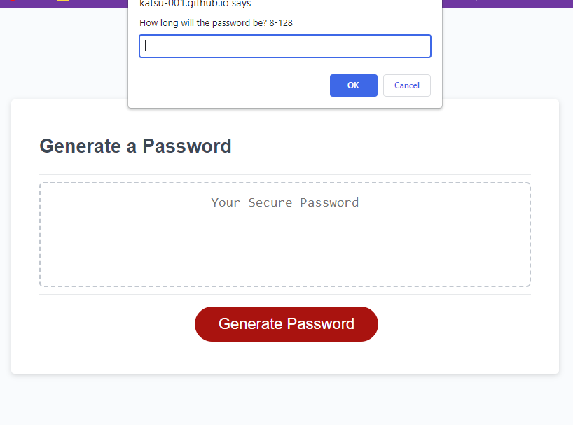

# Interactive Password Generator

## Description

This application generates a randomized password, and allows the user to select length and character types used.

## Usage

Follow the URL to the deployed application. Click the generate password button, and follow prompts.

## URL

[Deployed URL](https://katsu-001.github.io/passwordGen/)

[GitHub Repository](https://github.com/Katsu-001/passwordGen)

## Credits

Initial starter code was supplied by class. Collabetation was used to help form the function for generating the password array. 